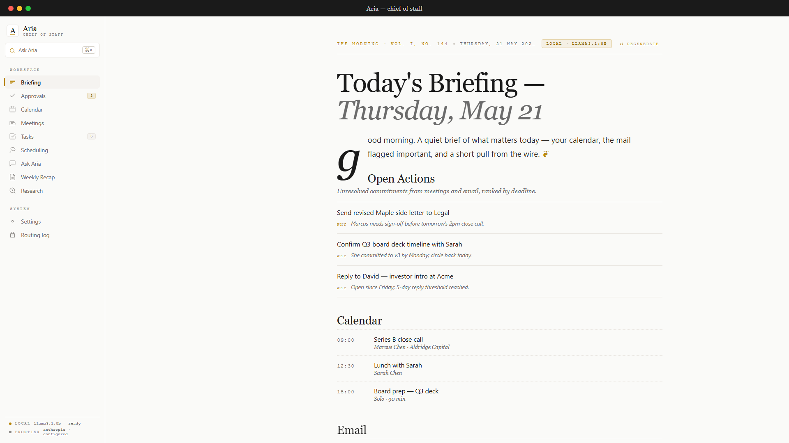
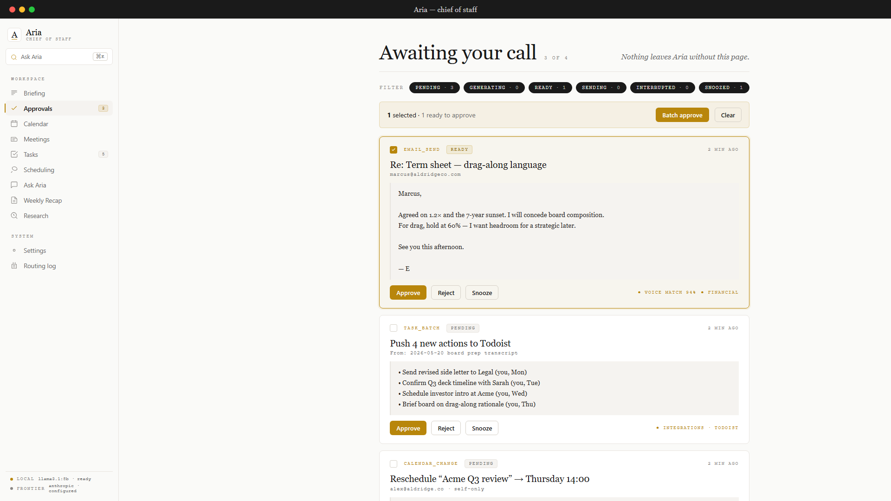
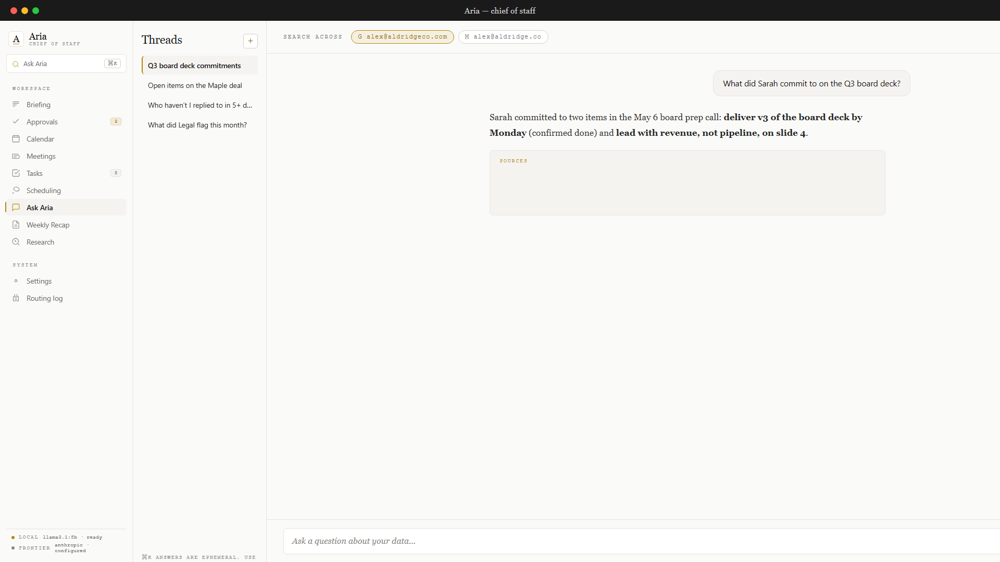
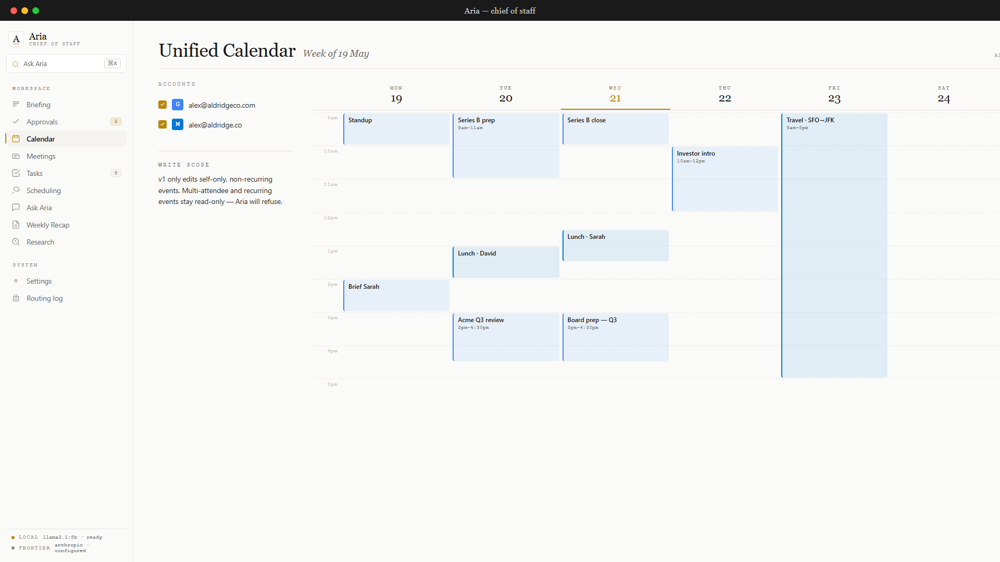

# Aria

[](./LICENSE)

**Local-first desktop AI chief-of-staff for busy executives.**

Aria is a desktop application for SMB executives, founders, and senior leaders who need signal out of the noise. It generates a structured daily briefing from your calendar, inbox, and connected tools each morning, then works through the day triaging email, surfacing meeting prep, capturing commitments, scheduling smarter, and answering questions about your own history — all from data that stays on your machine. No cloud sync, no shared servers: your calendar, email, and meeting notes never leave your device.

## Screenshots

| Daily Briefing | Approvals Queue |
|:---:|:---:|
|  |  |

| Ask Aria (RAG) | Calendar |
|:---:|:---:|
|  |  |

## Features

- **Daily AI briefing** — structured morning digest from calendar, email, news, and open action items
- **Email triage** — urgency scoring across Gmail and Outlook; top URGENT + ACTION items surfaced in the briefing
- **Draft emails in your voice** — reply drafts learned from your sent mail; every draft requires explicit approval before sending
- **Approval-gated actions** — no email sends, calendar changes, or task creates happen without your explicit confirmation
- **Smart calendar scheduling** — conflict detection, scheduling rule preferences, and Google/Outlook write support (approval-gated)
- **Meeting capture and action extraction** — paste or dictate notes after a meeting; commitments and decisions extracted and tracked
- **RAG Q&A over your data** — ask natural-language questions about emails, meetings, and notes via Cmd+K / Ctrl+K
- **Background integrations** — system-tray presence, auto-launch on login, and meeting prep notifications
- **Weekly recap export** — Word (.docx) and PDF recap documents generated every Friday
- **Multi-provider** — Google (Gmail + Calendar) and Microsoft (Outlook + Calendar via Graph API) with Todoist task sync

## Privacy & Local-First

All calendar, email, meeting, and task data is stored locally in an SQLCipher-encrypted SQLite database (AES-256 whole-database encryption). Only scoped LLM prompts leave the machine — sent via your own API keys to OpenAI, Anthropic, or Google AI — with PII-flagged content pre-routed to a local Ollama model so sensitive data never reaches a frontier API. Secrets (OAuth tokens, API keys) are stored in the OS keychain via Electron `safeStorage` (Keychain on macOS, DPAPI on Windows, libsecret on Linux) and never written to disk as plaintext. Aria cannot send email, modify your calendar, or create tasks without an explicit approval step from you.

## Architecture at a Glance

```
┌─────────────────────────────────────────────────────┐
│  Renderer (React 18 + Tailwind)                      │
│  React Router · Zustand · TanStack Query             │
└────────────────────┬────────────────────────────────┘
                     │ contextBridge (typed IPC)
┌────────────────────▼────────────────────────────────┐
│  Main Process (Node.js / Electron 41)                │
│  ┌──────────────┐  ┌──────────────┐  ┌───────────┐ │
│  │ SQLCipher DB │  │ Ollama local │  │ Frontier  │ │
│  │ better-      │  │ LLM sidecar  │  │ APIs      │ │
│  │ sqlite3      │  │ (port 11434) │  │ (Anthropic│ │
│  │ + sqlite-vec │  │              │  │  OpenAI   │ │
│  └──────────────┘  └──────────────┘  │  Google)  │ │
│  ┌───────────────────────────────┐   └───────────┘ │
│  │ OAuth providers               │                  │
│  │ Google (googleapis 144)       │                  │
│  │ Microsoft (MSAL + Graph)      │                  │
│  │ Todoist                       │                  │
│  └───────────────────────────────┘                  │
└─────────────────────────────────────────────────────┘
```

The main process owns all data access and LLM calls; the renderer communicates via a typed IPC bridge. Sensitive content is routed to the local Ollama model before any frontier API call is considered.

## Quick Start

See [docs/DEVELOPMENT.md](docs/DEVELOPMENT.md) for prerequisites, OAuth setup, and running instructions.

## Built with Claude Code + GSD

This project was planned and built using [Claude Code](https://claude.ai/code) and the [GSD (Get Shit Done)](https://github.com/anthropics/claude-code) workflow system. Every phase — from initial stack selection through the RAG engine, approval queue, meeting capture, and packaging — was designed, reviewed, and executed through GSD's structured plan-then-execute loop.

The full decision history lives in [`.planning/`](.planning/): phase plans, research documents, context decisions, and architectural trade-off notes. If you want to understand why a particular technology was chosen or how a feature was designed, the decision log is at [`.planning/ROADMAP.md`](.planning/ROADMAP.md).

## Status

**Showcase / source-available.** This is a solo-developer project built as a working proof-of-concept of the local-first AI chief-of-staff idea. It is not production-hardened for multi-tenant or enterprise use. To run Aria you will need to bring your own credentials:

- A Google Cloud project with OAuth 2.0 credentials (Gmail + Calendar scopes)
- An Azure app registration for Microsoft OAuth (optional, for Outlook + Exchange)
- API keys for at least one frontier LLM provider (Anthropic, OpenAI, or Google AI)
- [Ollama](https://ollama.ai) running locally for the sensitivity router and RAG embeddings

No warranty is provided. See [docs/DEVELOPMENT.md](docs/DEVELOPMENT.md) for the full setup walkthrough.

## License

MIT — see [LICENSE](./LICENSE).
